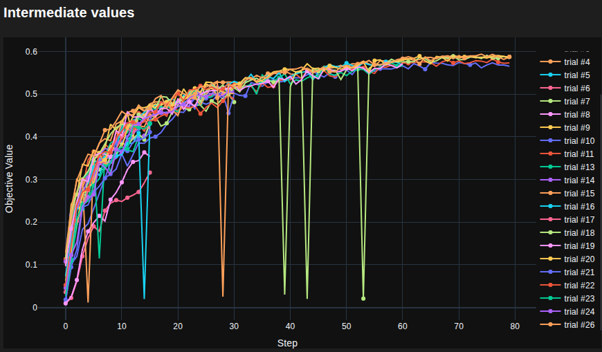
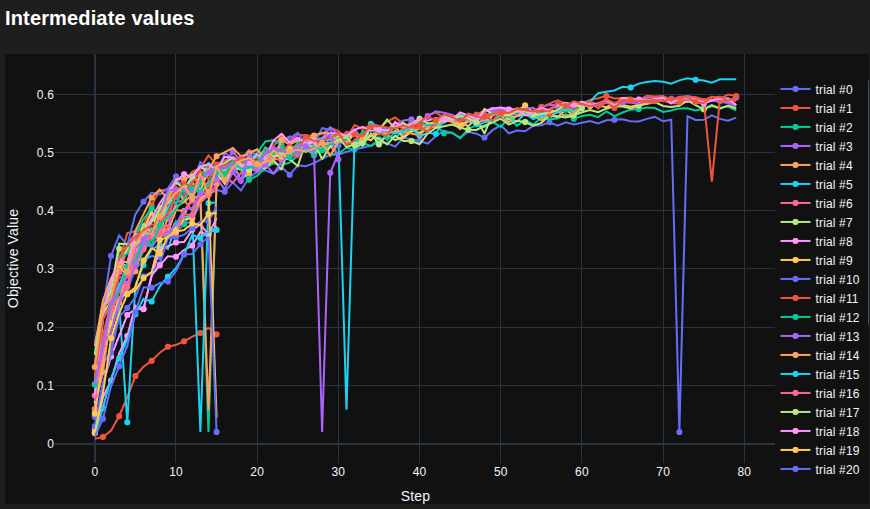
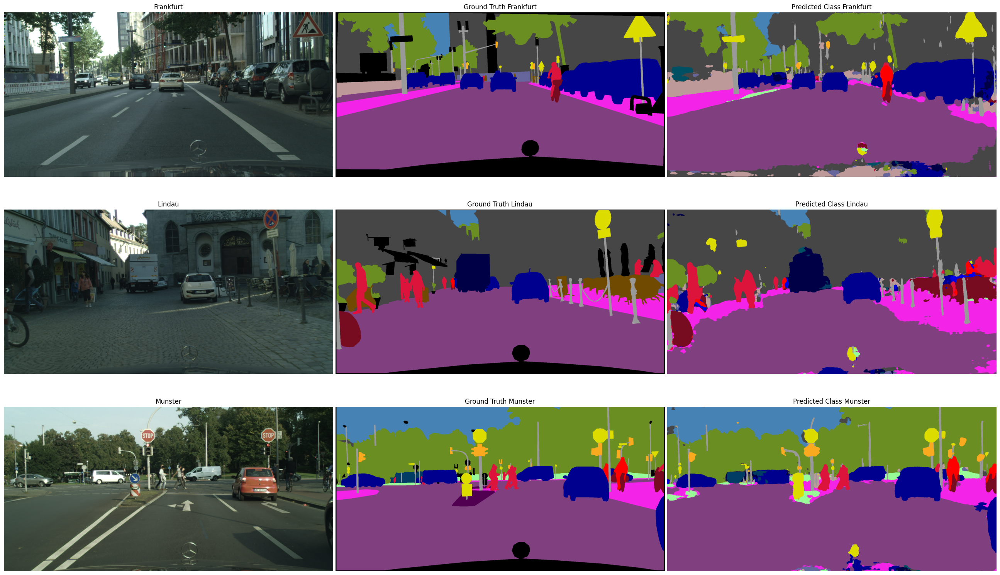

<h1 align="center"> Semantic Segmentation for Autonomous Driving </h1>

<h3 align="center"> End-to-End Pipeline: U-Net with ResNet34, Optuna Hyperparameter Optimization, and TensorRT Real-Time Deployment </h3>

 

## :book: Table of Contents

  
Table of Contents

1. [➤ About The Project](#about-the-project)
2. [➤ Folder Structure](#folder-structure)
3. [➤ Test Environment](#test-environment)
4. [➤ Implementation Details](#implementation-details)
5. [➤ Cityscapes Dataset](#cityscapes-dataset)
6. [➤ Hyperparameter Tuning (Optuna)](#hyperparameter-tuning)
7. [➤ Results and Discussion](#results-and-discussion)
8. [➤ Conclusion](#conclusion)
9. [➤ References](#references)

 

## :memo: About The Project 

This project tackles the complete lifecycle of a **Semantic Segmentation** system designed for **Autonomous Driving**: from data preprocessing and model design, through rigorous hyperparameter optimization, to real-time deployment on GPU.

The work began with a **custom U-Net trained from scratch** (filter dimensions `[32, 64, 128, 512, 1024]`). This baseline reached a mean IoU of only ~0.20, confirming that training a deep encoder on a limited dataset from random initialization is insufficient for this task. The architecture was then restructured to leverage **Transfer Learning**: the custom encoder was replaced with a pretrained **ResNet34** (ImageNet weights) and a **Gradual Unfreezing** strategy was explored to fine-tune deeper encoder layers during the later training stages. This transition yielded a dramatic improvement, raising the final mIoU to **0.6279**.

The full pipeline is built for **high performance and reproducibility**:
- **PyTorch Lightning** provides the structured training loop with mixed-precision support and metric tracking.
- **Optuna** automates the hyperparameter search with Bayesian sampling and early stopping.
- An **overlap-tiling strategy** with 2D Gaussian window blending reconstructs high-resolution predictions to avoid OOM in the validation phase with the 1024x2048 images.
- For deployment, the model is exported to **ONNX** and accelerated with **TensorRT**, achieving **~111 FPS** — well above real-time requirements.

 

> **Note:** This repository uses **Git LFS** to store the pre-trained weights (`best_model.ckpt`). You must have [Git LFS](https://git-lfs.com/) installed prior to cloning to successfully download the file.

 

## :file_folder: Folder Structure 

    SemanticSegmentation_AutonomousDriving
    ├── SemanticSegmentation_AutonomousDriving.ipynb   # Main execution notebook
    ├── README.md
    ├── optuna_search.db                               # Optuna study database
    │   
    ├── model
    |   ├── DriveSegmentationLightningModule.py        # LightningModule: training, validation, scheduling
    |   └── DriveSegmentationModel.py                  # U-Net / ResNet34 architecture definition
    │   
    ├── utils
    |   ├── posttraining_utils.py                      # Checkpointing, ONNX export, TensorRT inference
    |   ├── preprocesing_utils.py                      # Albumentations pipeline, class weights, label mapping
    |   └── trainmodels_utils.py                       # Optuna integration, profiling, training orchestration
    │
    ├── CityscapesDataModule.py                        # PyTorch Lightning DataModule for Cityscapes
    ├── Dice_CrossEntropy_Loss.py                      # Custom Dice + Cross-Entropy combined loss
    │
    ├── best_model                                     # Saved PyTorch checkpoints and ONNX model
    ├── Cityscapes_data                                # Raw Cityscapes dataset (not included in repo)
    └── output_predictions_onnx                        # Inference output: colored masks and overlays

 

## :computer: Test Environment 

The project was developed and tested under the following hardware and software configuration:

* **Processor (CPU)**: Intel Core i9-12900K up to 5.2 GHz Max Turbo (16 cores, 24 threads)
* **Memory (RAM)**: 32 GB DDR5 at 5600 MHz
* **Graphics Card (GPU)**: NVIDIA GeForce RTX 3080 Ti with 12 GB VRAM
* **Operating System**: Ubuntu 24.04 (64-bit)
* **Python Version**: 3.12.7
* **Key Libraries and Dependencies**:
  * CUDA 12.8 / cuDNN 9.10.02
  * albumentations 2.1.0
  * torch 2.9.1+cu128
  * torchvision 0.24.1
  * torchmetrics 1.8.2
  * lightning 2.6.1
  * optuna 4.7.0
  * tensorboard 2.6.4
  * onnxruntime-gpu 1.26.0
  * tensorrt 10.16.1.11
 

## :brain: Implementation Details 

To maximize semantic segmentation performance and training stability, several advanced techniques were implemented:

- **Data Augmentation Pipeline**: A robust preprocessing and augmentation pipeline is implemented using the `Albumentations` library. To prevent overfitting, transformations such as random cropping, horizontal flipping, shift/scale/rotate, color jittering, and alternating Gaussian blurring/sharpening are systematically applied to the training dataset.
- **Model Architecture**: A robust **U-Net** decoder paired with a pretrained **ResNet34** encoder. Support for gradient checkpointing is included to minimize VRAM usage, allowing for larger batch sizes. The code also allows for generating a custom U-Net architecture with a variable number of encoder and decoder layers. The decoder convolutional weights are initialized using **Kaiming Normal (He)** initialization for optimal gradient flow with ReLU activations.
- **Gradual Unfreezing / Partial Fine-Tuning**: The training loop is designed so the ResNet encoder starts frozen to allow the custom decoder to stabilize. Specific deeper layers (like the `layer3` and `layer4` bottlenecks) can then be unfrozen at a later epoch, which noticeably improves the model's performance. Alternatively, it can remain completely frozen for the entire training process.
- **Loss Function**: A custom `DiceCrossEntropyLoss` is utilized that combines **Dice Loss** (excellent for handling extreme class imbalance) with standard **Cross-Entropy Loss**. Both loss components share a single `log_softmax` computation for numerical stability and efficiency. Class weights are pre-computed using the **ENet** method to further penalize misclassifications of rare classes.
- **Optimizer (AdamW with Differential Learning Rates)**: The **AdamW** optimizer is configured with separate learning rate groups — a lower rate for the pretrained encoder and a higher rate for the decoder — to prevent catastrophic forgetting of ImageNet features while allowing the decoder to learn rapidly.
- **Learning Rate Scheduling**: An advanced `SequentialLR` scheduler is used. It starts with a `LinearLR` warmup to stabilize initial noisy gradients, followed by a `CosineAnnealingLR` schedule to navigate local minima and ensure optimal convergence.
- **Gradient Clipping**: Global gradient clipping (`gradient_clip_val=1.0`) is applied to prevent exploding gradients, ensuring stable convergence during the complex multi-component loss optimization.
- **Validation Tiling Strategy**: To validate high-resolution inputs accurately, the images are split into overlapping tiles. A **2D Gaussian patch** is then applied to weight the center pixels of the tiles higher than the edges, completely avoiding harsh grid-like artifacts upon reconstruction.

### Hardware & Performance Optimizations
To significantly reduce training time and memory overhead, several low-level PyTorch and hardware optimizations were integrated:
- **PyTorch 2.0 Compilation (`torch.compile`)**: The model is compiled using the `torchinductor` backend to fuse operations and accelerate training. This is further optimized by enabling `fx_graph_cache`, `memory_planning`, `epilogue_fusion`, and mapping 1x1 convolutions to matrix multiplications. For specific functions (like max pooling backward passes), eager-mode fallback (`@torch.compiler.disable`) is used to circumvent known Triton kernel bugs with mixed precision.
- **Tensor Cores & Precision Optimizations**: Matrix multiplication precision is explicitly lowered to use TF32 and bfloat16 (`torch.set_float32_matmul_precision('medium')` and `cudnn.allow_tf32 = True`), vastly accelerating convolutions on the Ampere GPU.
- **cuDNN Auto-Tuning**: `torch.backends.cudnn.benchmark = True` is enabled to automatically search and find the most efficient convolution algorithms for the specific input sizes during runtime.
- **Channels-Last Memory Format**: The model and input tensors are converted to `torch.channels_last` (NHWC), which provides substantial speedups on NVIDIA Tensor Cores for convolutional operations compared to the default NCHW format.
- **Mixed Precision (`bf16-mixed`)**: Training utilizes BFloat16 mixed precision via PyTorch Lightning. Unlike `fp16`, `bf16` maintains the same dynamic range as `fp32`, entirely avoiding gradient scaling issues (NaNs/Infs) while doubling throughput.
- **ONNX Runtime I/O Binding**: During deployment/inference, memory transfer overhead is drastically reduced by using ONNX Runtime's `IOBinding` and `OrtValue` structures, pushing image batches directly into GPU memory (`device_type="cuda"`) without intermediate CPU buffers.
- **Dataloader Bottleneck Reduction**: Data loaders are configured with `pin_memory=True`, `persistent_workers=True`, and `prefetch_factor=2` to ensure the GPU is never starved of data. Additionally, OpenCV's internal thread pool is explicitly disabled (`cv2.setNumThreads(0)`) to prevent thread collisions and Out-of-Memory (OOM) deadlocks with PyTorch's multiprocess workers.
- **PyTorch Profiler**: Used systematically to identify and eliminate CPU/CUDA execution bottlenecks and memory leaks during the development phase.

 

## :zap: Cityscapes Dataset 

The **Cityscapes Dataset** is a large-scale benchmark for semantic understanding of urban street scenes. It provides pixel-level annotations for **19 semantic classes** grouped into categories:

| Category | Classes |
|---|---|
| **Flat** | Road, Sidewalk |
| **Human** | Person, Rider |
| **Vehicle** | Car, Truck, Bus, Train, Motorcycle, Bicycle |
| **Construction** | Building, Wall, Fence |
| **Object** | Pole, Traffic Light, Traffic Sign |
| **Nature** | Vegetation, Terrain |
| **Sky** | Sky |

Due to the extreme variation in pixel frequencies (roads occupy vastly more pixels than traffic lights), **class weighting** is critical. This project is configured to compute class weights dynamically using three distinct methods: **inverse frequency**, **median frequency balancing**, and **ENet** logarithmic balancing (`1 / ln(c + freq)`).

Additionally, a custom **label remapping** is implemented that efficiently converts the original 34 Cityscapes class IDs into the 19 training IDs (mapping all unlabeled/void classes to `ignore_index=255`), using a safe 256-entry lookup tensor to prevent CUDA indexing errors.

 

## :test_tube: Hyperparameter Tuning (Optuna) 

Given the complexity of the architecture and the custom loss function, manual tuning would be highly inefficient. An automated, Bayesian-driven hyperparameter search was conducted using **Optuna**. The search leverages the **Tree-structured Parzen Estimator (TPE)** sampler for efficient space exploration, and an **ASHA (Successive Halving)** pruner to prematurely terminate unpromising trials and save massive amounts of compute time.

For the partially unfreed study, 35 distinct trials were evaluated to discover the optimal configuration across several dimensions, due to the large combination of hyperparameters. The search space and fixed parameters were established as follows:

- **Fixed Training Parameters**: `max_epochs` (80), `batch_size` (16), `weight_decay` (1e-5), `crop_size` (512x512), `stride` (256x256), `use_checkpointing` (disabled), and ENet-based class weighting.
- **Optimization Parameters**: Learning rates for the encoder (`1e-5` to `1e-4`, step `1e-5`) and decoder (`1e-4` to `1e-3`, step `1e-4`), along with the length of the warmup phase (`5` or `10` epochs).
- **Regularization**: Dropout probabilities (`0.0` to `0.3`, step `0.1`) and gradient accumulation steps (`1`, `2`, or `4`).
- **Architectural Dynamics**: The precise training epoch to unfreeze the ResNet34 encoder layers 3 and 4 (bottleneck) (`10` to `70`, step `10`) for partial fine-tuning.
- **Loss Balancing**: The weighting ratio between the Dice Loss and Cross-Entropy Loss (`weight_dice` from `0.1` to `0.8`, step `0.1`).

Conversely, for the **totally frozen** study case, the hyperparameter `unfreeze_epoch` was fixed to `None`, and `enc_learning_rate` could be set to any value, since the encoder remains completely frozen throughout the training and does not learn anything.

This automated approach ensures the hyperparameters were rigorously optimized for the specific challenges of the Cityscapes dataset without introducing subjective bias.

### Optuna Studies

To determine the most effective fine-tuning strategy, two separate hyperparameter optimization studies were conducted. It is important to note that the final, best-performing model is selected from the **partially unfrozen** (partially unfreed) study, as it consistently offers the best overall performance and higher accuracy.

 

 

## :mag_right: Results and Discussion 

### Model Performance

The best U-Net + ResNet34 configuration, discovered via Optuna, achieved a validation **mean IoU of 0.6279** using the macro-averaged `MulticlassJaccardIndex` metric across all 19 Cityscapes classes.

The prediction on the validation dataset yields the following Intersection over Union (IoU) scores, showcasing both the global performance and the per-class breakdown in the validation dataset:

| Class | IoU | Frequency |
|---|---|---|
| **Global mIoU** | **0.6279** |  |
| Road | 0.9485 | 37.65% |
| Sidewalk | 0.6915 | 5.41% |
| Building | 0.8710 | 21.92% |
| Wall | 0.3513 | 0.73% |
| Fence | 0.3935 | 0.82% |
| Pole | 0.5158 | 1.48% |
| Traffic Light | 0.5912 | 0.20% |
| Traffic Sign | 0.6995 | 0.67% |
| Vegetation | 0.8898 | 17.32% |
| Terrain | 0.4914 | 0.83% |
| Sky | 0.9006 | 3.35% |
| Person | 0.7381 | 1.30% |
| Rider | 0.5230 | 0.22% |
| Car | 0.8992 | 6.51% |
| Truck | 0.3254 | 0.30% |
| Bus | 0.5785 | 0.39% |
| Train | 0.3367 | 0.11% |
| Motorcycle | 0.4719 | 0.08% |
| Bicycle | 0.7127 | 0.71% |

 

Below are examples of the model's predictions on 3 randomly selected images from the validation dataset:

As seen in the examples above, the model generally performs very well but occasionally struggles with predicting sharp borders between different classes and can produce minor visual artifacts.

### ONNX and TensorRT Deployment

For real-world deployment, a self-contained **wrapper module** is designed that bakes the ImageNet normalization and `argmax` class decoding directly into the computational graph. The model is then exported to **ONNX** (opset 21, FP16 precision, dynamic batch axis) and accelerated through the **TensorRT Execution Provider** with engine caching for instant cold-start loading.

**Inference Benchmarks (RTX 3080 Ti — 1024×2048 images):**

| Metric | Value |
|---|---|
| Average time per frame | 9.05 ms |
| Median time per frame | 8.95 ms |
| Throughput | **110.5 FPS** |

This TensorRT conversion yielded a massive acceleration suitable for real-time video feeds. Crucially, the validation mIoU remains fully identical to the native PyTorch baseline (**0.6279**) without any performance loss. This was achieved by converting the model weights to FP16 (`model.half()`) prior to the ONNX export, which also significantly boosts inference speed by maximizing hardware-level half-precision acceleration on the GPU.

### Ongoing Work

Current efforts focus on reducing the minor **"salt-and-pepper" noise artifacts** observed in some predictions. Potential approaches to explore include post-processing refinement (like CRFs or morphological operations) and further architectural adjustments.

 

## :bulb: Conclusion 

This project demonstrates a complete, production-grade pipeline for semantic segmentation tailored for autonomous driving scenarios:

1. **Architecture Design** — Systematic progression from a custom U-Net baseline to a Transfer Learning approach with ResNet34, achieving a 3× improvement in mIoU.
2. **Training Engineering** — Extensive use of mixed precision, `torch.compile`, channels-last memory, and cuDNN auto-tuning to maximize GPU utilization.
3. **Hyperparameter Optimization** — Rigorous Bayesian search with Optuna (TPE + ASHA) across **35 trials**, covering multiple hyperparameter dimensions simultaneously.
4. **Real-Time Deployment** — ONNX export with TensorRT acceleration delivering **111+ FPS** at full Cityscapes resolution, meeting the strict latency requirements of autonomous driving systems.

 

## :link: References 

- Ronneberger, O., Fischer, P., & Brox, T. (2015). U-Net: Convolutional Networks for Biomedical Image Segmentation. *MICCAI*. https://doi.org/10.1007/978-3-319-24574-4_28
- He, K., Zhang, X., Ren, S., & Sun, J. (2016). Deep Residual Learning for Image Recognition. *CVPR*. https://doi.org/10.1109/CVPR.2016.90
- Cordts, M., Omran, M., Ramos, S., et al. (2016). The Cityscapes Dataset for Semantic Urban Scene Understanding. *CVPR*. https://doi.org/10.1109/CVPR.2016.350
- Paszke, A., Chaurasia, A., Kim, S., & Culurciello, E. (2016). ENet: A Deep Neural Network Architecture for Real-Time Semantic Segmentation. https://arxiv.org/abs/1606.02147
- Paszke, A., Gross, S., Massa, F., et al. (2019). PyTorch: An Imperative Style, High-Performance Deep Learning Library. *NeurIPS*. https://arxiv.org/abs/1912.01703
- Akiba, T., Sano, S., Yanase, T., Ohta, T., & Koyama, M. (2019). Optuna: A Next-generation Hyperparameter Optimization Framework. *KDD*. https://doi.org/10.1145/3292500.3330701
- Buslaev, A., Iglovikov, V., Khvedchenya, E., Parinov, A., Druzhinin, M., & Kalinin, A. (2020). Albumentations: Fast and Flexible Image Augmentations. *Information*, 11(2), 125. https://doi.org/10.3390/info11020125
- NVIDIA CUDA Toolkit: https://developer.nvidia.com/cuda-toolkit
- NVIDIA TensorRT: https://developer.nvidia.com/tensorrt
- PyTorch Lightning: https://lightning.ai/docs/pytorch/stable/
- ONNX Runtime: https://onnxruntime.ai/
